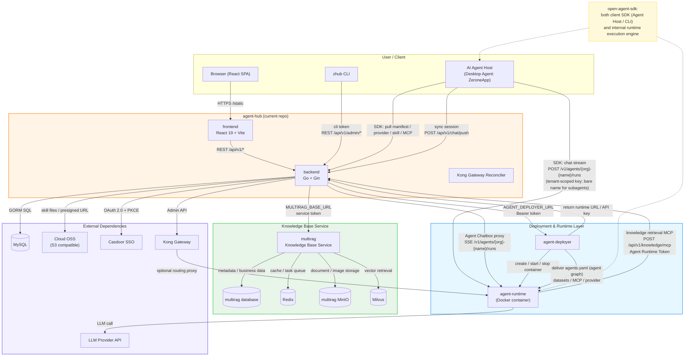

# Architecture

Architecture, deployment topology, and project structure of agent-hub.

## System Architecture



## Multi-Tenancy, Multi-Org Login & Ops API

- **Tenant = Casdoor org** (casdoor mode) / `default` (builtin mode). Business tables carry a `tenant_id` column; roles are managed locally in `user_identities` (Casdoor only provides identity).
- **Multi-org login**: a second and subsequent org can log in through its own Casdoor Application, registered via the Ops API (`/api/v1/ops/tenant-clients`, guarded by the `X-Ops-Key` header). See configuration.md for the runbook.
- **Tenant-scoped deployment keys**: runtime URL `/<org>/<name>`, Kong/deployer key `<org>-<name>`; the hub chat proxy addresses runtimes by qualified name (`/v1/agents/<org>-<name>`, bare name → 404 except subagents).

## Recommended Configuration for Single-ECS Deployment

> Assumption: **Excluding the multirag knowledge base and the desktop Agent (ZeroneApp)**, `agent-hub`, `agent-deployer`, `agent-runtime` containers and their dependencies (MySQL, Casdoor, Kong) are all deployed on a single ECS, with cloud OSS used as object storage.

| Configuration | Demo | Single-node Production | Larger-scale Production |
|---|---|---|---|
| **ECS spec** | `ecs.g7i.2xlarge` | `ecs.g7i.4xlarge` | `ecs.g7i.8xlarge` |
| **CPU** | 8 vCPU | 16 vCPU | 32 vCPU |
| **Memory** | 32 GiB | 64 GiB | 128 GiB |
| **System disk** | 100 GiB ESSD PL0 | 100 GiB ESSD PL0/PL1 | 100 GiB ESSD PL1 |
| **Database disk** | 200 GiB ESSD PL1 | 500 GiB ESSD PL1 | 1 TiB ESSD PL1 |
| **Object storage** | Cloud OSS | Cloud OSS | Cloud OSS |
| **Total disk capacity** | ~300 GiB | ~600 GiB | ~1.1 TiB |
| **Public bandwidth** | 100 Mbps, pay-by-traffic | 100 Mbps, pay-by-traffic | 100 Mbps, pay-by-traffic |
| **Recommended runtime containers** | 1–2 | 3–5 | 6–10 |
| **Concurrent sessions** | 5–10 | 20–50 | 50–150 |
| **Use cases** | Customer demos, internal testing | Production with low-to-medium concurrency | Multiple Agents, high-frequency tool calls |
| **Final recommendation** | Recommended purchase | Recommended starting single-node production config | Beyond this scale, split services |

> **Note**: Total disk capacity includes only the system disk + database disk. If Docker images or container logs are heavily cached locally, an additional 100–200 GiB data disk may be added.

**Additional conclusions**:

- A demo environment can run with as few as 4 cores and 16 GB, but only supports 1 runtime; with MySQL and Casdoor sharing memory, headroom is minimal — not recommended for purchase.
- For production, choose directly: **16 cores, 64 GB + 100 GB system disk + 500 GB database disk + Cloud OSS + 100 Mbps pay-by-traffic bandwidth**.
- Object storage uses Cloud OSS; no local MinIO object disk required. `agent-hub` accesses it directly via `OSS_ENDPOINT` without consuming ECS disk.
- Port exposure: only `80/443` should be publicly accessible. MySQL, Casdoor, Kong, deployer (8080), and dynamic runtime ports must not be exposed to the public internet.
- Production data must be backed up to a separate OSS. A single ECS is a "single-node production" deployment and provides no high availability.
- It is recommended to set `--memory=4g` / `--cpus=2` limits per runtime container to prevent a single Agent with a long loop or heavy tool calls from exhausting the entire machine.
- If Agents make heavy use of local tools, long SSE streams, or the filesystem, production configuration should be raised to at least **32 cores, 128 GB**. For even higher loads, deploy runtime nodes on separate infrastructure.

---

## Project Structure

```
.
├── cmd/server/              # Entry point (route registration + DI + embedded SPA static assets)
├── internal/
│   ├── domain/              # Domain models: agent / aigc / auth (user_identities, tenant_oauth_clients,
│   │                        #   cli_tokens, invites, refresh_tokens, users) / chat / knowledge / mcp /
│   │                        #   provider / scene / skill / tenant (context.go only)
│   ├── application/services/ # Business services + input validators
│   ├── infrastructure/
│   │   ├── persistence/     # GORM Repository
│   │   └── oss/             # OSS client wrapper
│   ├── handler/             # Gin HTTP Handler + ServiceRouter reverse proxy
│   ├── middleware/          # JWTAuth / RequireAdmin / RequireManager / tenant / role / ops_key / Logger / Recovery / CORS
│   ├── auth/                # AuthProvider (builtin user system + Casdoor OAuth + PKCE), multi-org login,
│   │                        #   local role management (user_identities)
│   └── config/              # Viper configuration
├── pkg/
│   ├── database/            # GORM initialization + AutoMigrate
│   └── oss/                 # S3 / MinIO upload interface
├── frontend/                # React SPA (build artifacts embedded into the binary)
├── quickstart/
│   ├── docker-compose.yml   # Quick Start (MySQL + hub image, builtin auth mode)
│   └── docker-compose.build.yml # Overlay for building the hub image from source
├── Dockerfile               # Multi-stage build
└── .github/workflows/       # GitHub Actions (ci.yml / release.yml / cli-publish.yml)
```

### DDD Layering Conventions

- `domain/` — Pure models, no business logic
- `application/services/` — Business orchestration + DTO conversion + validation
- `infrastructure/persistence/` — Data access, thin GORM wrapper
- `handler/` — HTTP input parsing, error responses, status codes
